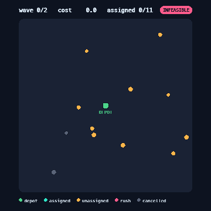

# OptimBench

Verifiable environments for evaluating optimization and planning agents under real-world constraints.

Modern language-model agents can reason, but it is still hard to measure whether they can *reliably operate under constraints* — limited resources, hard deadlines, and conditions that change mid-task. Task-completion scores hide how an agent fails, and most benchmarks cannot tell a genuinely good solution from one that quietly gamed the grader.

OptimBench is built around the one setting where correctness is checkable by code: optimization. Constraints are explicit, objectives are measurable, invalid solutions are detectable, and the gap to a reference is quantifiable. That makes the reward deterministic and hard to fake.

<p align="center">
  
</p>

The first environment is dynamic vehicle dispatch. An agent is given a fleet, a set of delivery orders with capacities and time windows, and a road network. It assigns orders, sequences routes, and commits a plan — and then a disruption hits (a vehicle breaks down, an urgent order arrives). The agent has to recover to a valid, low-cost plan. Because the disruptions cascade, a single-shot answer is impossible by construction.

## What it measures

Every score is computed deterministically, with no model-in-the-loop judge.

- **task** — dispatch quality behind a hard feasibility gate. The committed cost is compared to a strong deterministic reference that solves the same instance from scratch — sweep assignment, then nearest-neighbour plus 2-opt routing — capped at 1. Because the reference is independent of how the agent assigned its orders, this rewards good assignment *and* routing, not just routing. Zero if the final plan is infeasible.
- **robustness** — the fraction of post-disruption states the agent left feasible. Waves the agent never faced count as failures, so stalling to skip a disruption is penalized here.
- **integrity** — whether the agent reached its result honestly, rather than by spamming invalid actions, never committing, or leaving disruption waves unresolved.

The feasibility gate enforces real constraints: vehicle capacity, full order coverage, depot-anchored routes, and shift limits on a service-time-aware schedule. An agent cannot inflate its score by dropping the depot from a route or leaving orders unassigned. (Time windows are modeled but generously bounded in v1 — see the benchmark card.)

## Baseline results

A greedy dispatcher (best-fit assignment plus nearest-neighbour routing, re-planning after each disruption), 50 procedurally generated scenarios per difficulty:

| difficulty | feasibility | task | robustness | integrity |
| --- | --- | --- | --- | --- |
| easy | 100% | 0.844 | 1.000 | 1.000 |
| medium | 100% | 0.700 | 1.000 | 1.000 |
| hard | 100% | 0.622 | 1.000 | 1.000 |

The greedy baseline is always feasible and resolves every disruption, but its non-geometric best-fit assignment leaves real headroom against the sweep-plus-2-opt reference — and that headroom widens with difficulty, from 0.84 on easy to 0.62 on hard, as assignment quality starts to dominate. That gap is exactly the room a smarter agent has to improve, on both assignment and recovery.

## How it is built

The design is infrastructure first. A new constrained-optimization problem can be added without touching the framework, because every system depends only on the domain layer.

```
domain/        value objects, enums, the feasibility rules and schedule (no other dependencies)
generation/    procedural, feasibility-guaranteed scenario generation
simulation/    the environment and the agent tool API
verification/  the deterministic verifier (feasibility, objective, integrity)
agents/        the Agent interface and a greedy baseline
evaluation/    metrics and an evaluator with IQM and bootstrap confidence intervals
rendering/     a top-down renderer and GIF/MP4 export
```

The agent acts through a tool API rather than emitting a single answer: `list_orders`, `query_traffic`, `check_feasibility`, `assign_order`, `set_route`, `reroute`, `dispatch`, and `refuse`.

## Quickstart

```bash
git clone https://github.com/yferc/optimbench.git
cd optimbench
pip install -e ".[dev,media]"

pytest                                      # run the tests
python scripts/run_episode.py               # render an episode to docs/media/demo.gif
```

Evaluate an agent:

```python
from optimbench.agents import GreedyDispatcher
from optimbench.domain import Difficulty
from optimbench.evaluation import Evaluator

report = Evaluator().evaluate(GreedyDispatcher, Difficulty.MEDIUM, range(50))
print(report.format())
```

## Roadmap

OptimBench is the first member of a planned family of verifiable optimization environments (scheduling, packing, graph problems) sharing one generator, verifier, and metric suite. See `papers/benchmark_card.md` for the task definition, failure modes, and limitations.

## License

MIT.
